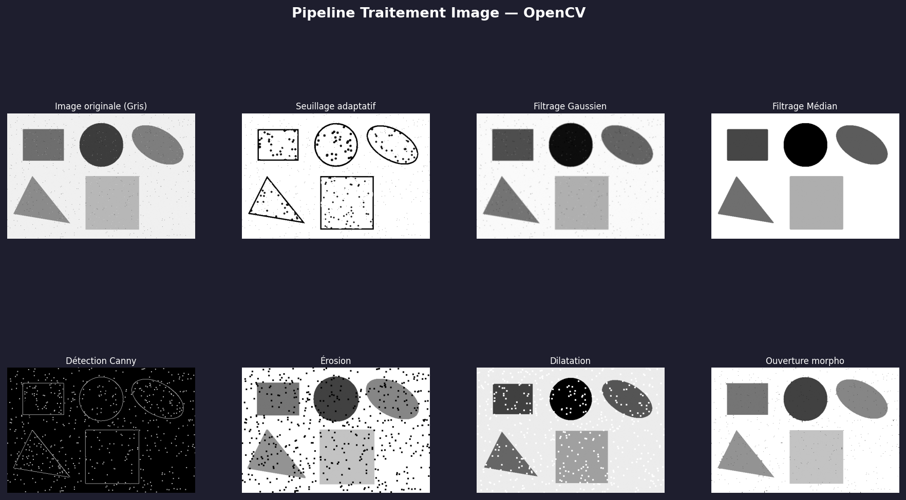

# 🖼️ Traitement d'Image — Pipeline OpenCV

Pipeline complet de traitement d'image en Python avec OpenCV : filtrage, morphologie, détection de contours et segmentation sur image réelle ou de démonstration.

## 📸 Aperçu



## 🎯 Fonctionnalités

| Technique | Description |
|-----------|-------------|
| Seuillage adaptatif | Binarisation locale Gaussian & Mean |
| Filtrage Gaussien | Lissage par convolution |
| Filtrage Médian | Réduction bruit impulsionnel |
| Détection Canny | Extraction contours par gradient |
| Érosion / Dilatation | Morphologie mathématique |
| Ouverture / Fermeture | Opérations morphologiques combinées |
| Détection de formes | Contours + bounding boxes annotés |

## 🗂️ Structure

```
traitement-image-opencv/
├── traitement_image.py   # Script principal
├── docs/
│   └── screenshot_traitement.png
└── README.md
```

## ⚙️ Installation

```bash
pip install opencv-python numpy matplotlib
```

## 🚀 Utilisation

```bash
# Avec image de démonstration (générée automatiquement)
python traitement_image.py

# Avec votre propre image
python traitement_image.py mon_image.jpg

# Sans affichage fenêtre (génère un PNG)
python traitement_image.py --no-display
```

## 🧠 Concepts couverts

- Traitement d'image bas-niveau (filtrage spatial)
- Morphologie mathématique (éléments structurants)
- Détection de contours (opérateur de Canny)
- Segmentation par seuillage adaptatif

## 🛠️ Technologies

**Python 3** · **OpenCV** · **NumPy** · **Matplotlib**

## 👩‍💻 Auteure

**Vanelle Stéphanie MANGOUA DJOUSSEU** — Recherche d'alternance en IA & Systèmes Embarqués
